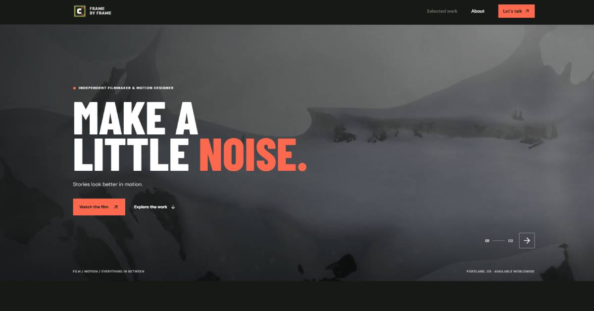

# Frame by Frame



An independent film, motion design, and animation portfolio with a private creator dashboard.

## Stack

- React 19 and Vite 8
- Express 5 and Node.js 24
- SQLite-backed creator account, profile, sessions, and video metadata
- Local disk storage for video, thumbnail, and profile-image uploads

## Local setup

Use Node.js 24 or newer. Copy `.env.example` to `.env`, then set unique values for `SESSION_SECRET` and `PORTAL_RECOVERY_CODE` before starting:

```sh
npm install
npm run dev
```

The local demo credentials are `admin@example.com` / `REDACTED`. They are for development only. On first sign-in at `http://localhost:5173/admin`, scan the authenticator QR code and verify a current code; this completes setup and opens the admin dashboard. New accounts cannot be created in the browser. Production owner accounts should be created with `npm run create-user -- owner@example.com`, which generates a random password. The **Forgot your password?** flow requires the private recovery code from `.env`; no password-reset email service is configured.

Vite serves the site on port `5173` and proxies `/api` to the Express API on port `3001`.

## Creator dashboard

- Edit the public display name, Pittsburgh location, bio, tags, and profile image. Limits are 80 characters for name, 100 for location, 600 for bio, and 8 tags of up to 24 characters each.
- Drag and drop or browse for MP4, M4V, MOV, or WebM videos up to 500 MB. The browser generates a thumbnail from a decoded video frame.
- Pick the generated frame or reuse a thumbnail from the creator's library. Add a title (up to 140 characters) and description (up to 1,200 characters).
- Uploaded projects are published to the homepage gallery and have their own watch/detail pages. Video playback supports HTTP byte-range requests for seeking.

## Security and storage

- Passwords use Node scrypt with per-user salts. Authenticator secrets are encrypted at rest.
- Sessions use random database-backed tokens in `HttpOnly`, `SameSite=Strict` cookies. Mutating requests require CSRF tokens; login, recovery, and uploads are rate-limited.
- Video and thumbnail files are inspected by file signature, not just filename or browser MIME type. Profile images are limited to JPEG, PNG, and WebP, up to 5 MB.
- Production requires a 32-character-or-longer `SESSION_SECRET` and `PORTAL_RECOVERY_CODE`. Serve the app behind HTTPS; production session cookies use `Secure`. Explicit demo passwords are refused when `NODE_ENV=production`.
- SQLite and media are stored in `server/data/` and `server/uploads/`, both ignored by git. Back up both locations. The SQLite driver is Node's built-in `node:sqlite` module and currently emits an experimental-feature warning.

## Production

Configure `.env` with your public site URL, social profile URLs, long random secrets, and persistent storage paths. Then build and run the combined API/site server:

```sh
npm run build
npm start
```

Host this Node server on a platform with persistent disk; GitHub Pages alone cannot run the authenticated API or SQLite storage. Set `TRUST_PROXY=1` only when the app is behind a trusted HTTPS reverse proxy.

Open Graph and Twitter cards use the deployed site's `og.jpg`, also shown in this README. Set `VITE_SITE_URL` to the exact public origin and base path, ending in `/`. Contact email defaults to `basherdan21@gmail.com`. The GitHub footer link is `https://github.com/dwilson-coder/danielportfolio`; Instagram is hidden until its URL is configured. Replace the example YouTube and LinkedIn URLs with the creator's own profiles.

## Planned updates

- Optional video transcoding and adaptive streaming for large uploads
- Caption and subtitle tracks
- Configurable moderation/approval before publishing a new upload
- Object-storage adapter and automated off-site backups

## Commands

- `npm run dev` starts the API and Vite server together.
- `npm run create-user -- email@example.com` creates the first owner account with a random password.
- `npm run build` builds the site and PWA assets.
- `npm run lint` runs Oxlint.
- `npm start` serves the production build and API.

## Asset attribution

The About-page ninja placeholder is Twemoji by Twitter, licensed under [CC BY 4.0](https://creativecommons.org/licenses/by/4.0/).
